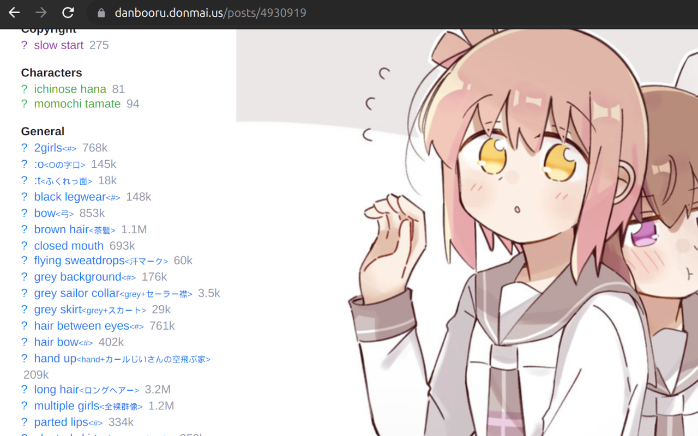
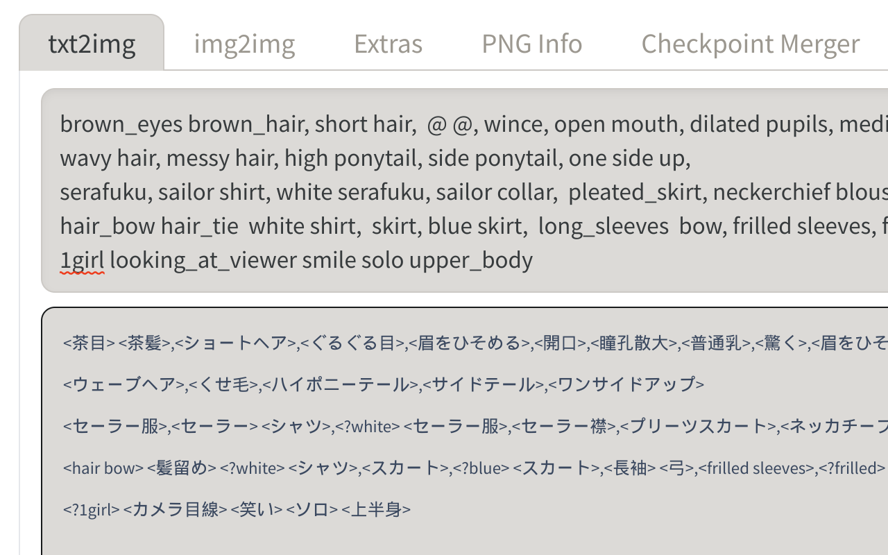
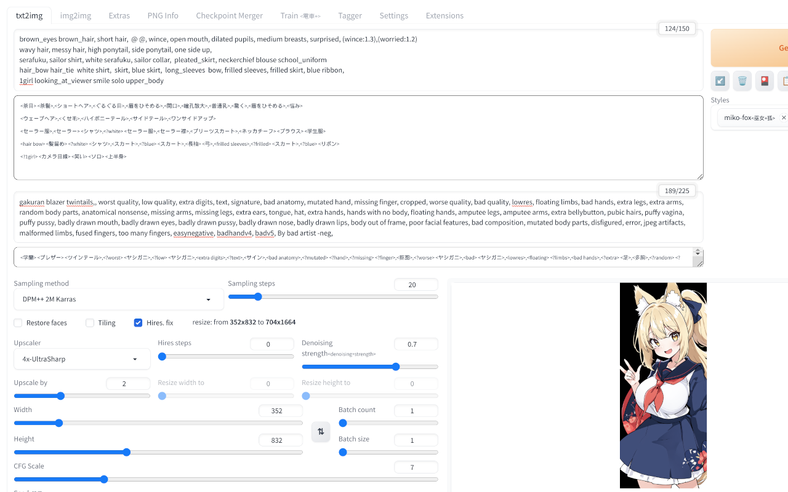

DanTagJa - StableDiffusion Tags translation to japanese, for on browser.
----
StableDiffusion等のプロンプトで使われるタグを日本語に翻訳表示します。

  
  
  


# Install
## Chrome
[Chrome Web Store][chrome]  
または、  
- zipファイルを[Download][Download]する。  
- zipファイルを解凍。  
- Chromeの拡張機能から「パッケージ化されていない拡張機能を読み込む」で解凍したディレクトリを指定する。  
## FireFox
[Firefox Add-ons][firefox]  
または、  
- zipファイルを[Download][Download]する。  
- FireFoxの拡張機能から「一時的なアドオンを読み込む」でダウンロードしたzipファイルを指定する。  


# License
Page replace: Mozilla Public License2.0  
English dictionary: [tag\_utils/LICENSE.md](/tag_utils/LICENSE.md)(Creative Commons Attribution-ShareAlike Licence (V3.0))  
Other: Clause-2 BSD License  


# TODO
## 済
- 収録漏れタグの収集・収録
- タグ毎にそれぞれの理由で間違っているタグデータの修正
- 翻訳データのないタグへの英単語翻訳ベースの翻訳追加
- StableDiffusionページの検出・ロード待ち処理の改善
## 未
- 退行を防ぐUnitTest
- StableDiffusion以外のページのprompt(novelai, civitai 等)への対応


# Develop

## セットアップ手順
Ubuntu環境で以下のコマンドを実行。
```
sudo apt install npm
npm install
```

## Build
以下のコマンドを実行。
```
npm run release
```

## 辞書データの生成
生成済みの辞書データが予めソースコードに含まれているのでBuildには不要。  


# Contact
mail: [michinari.nukazawa@gmail.com][mailto]  
twitter: [@MNukazawa][twitter]  

Develop by Michinari.Nukazawa, in project "[daisy bell][pixiv_booth_project_daisy_bell]".  

[chrome]: https://chrome.google.com/webstore/detail/dantagja/embefgjclalffflogbhkokfmfnfjhofa
[firefox]: https://addons.mozilla.org/ja/firefox/addon/dantagja/
[download]: https://github.com/MichinariNukazawa/DanTagJa_diffusion_tags_translation_ja_webextensions/releases
[pixiv_booth_project_daisy_bell]: https://daisy-bell.booth.pm/
[mailto]: mailto:michinari.nukazawa@gmail.com
[twitter]: https://twitter.com/MNukazawa
